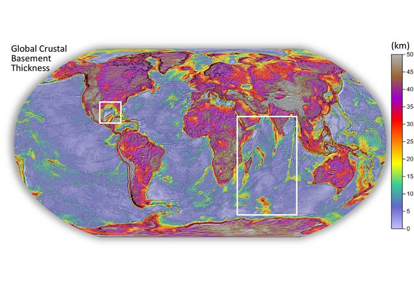
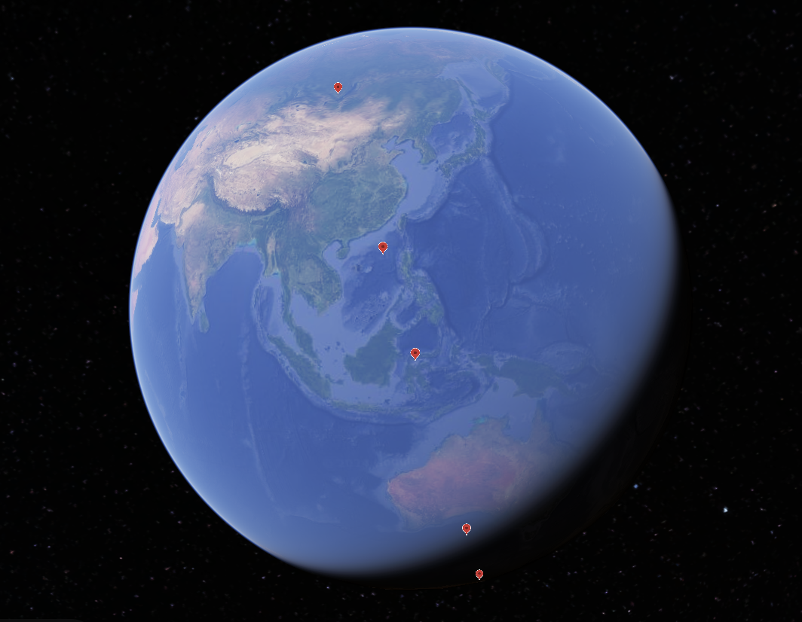
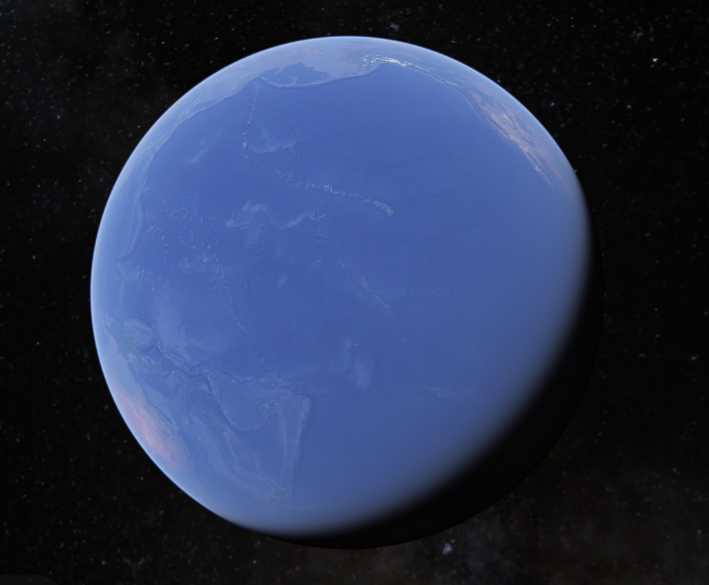
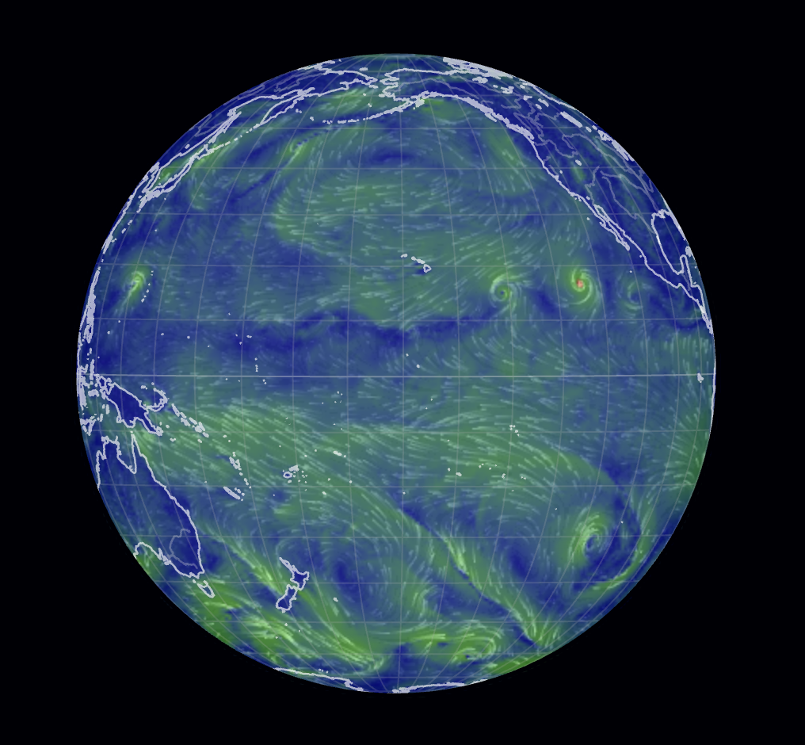
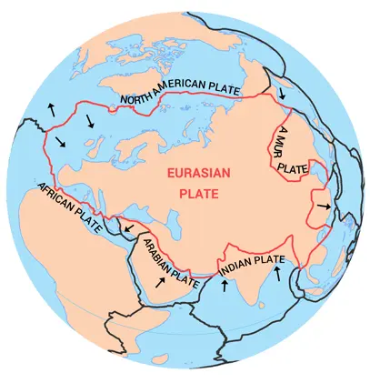
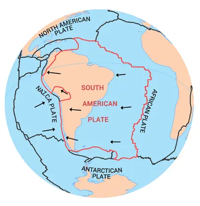
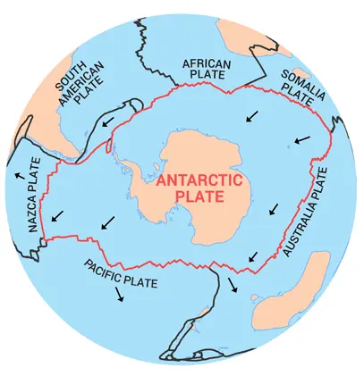

# Equatorial Bulge

Exploring how Earth's equatorial bulge may interplay with the ECDO.

## Intro

Earth is an oblate spheroid due to its rotation. Earth has an equatorial bulge of 43km.

Earth also has several internal layers:

These layers are of differing density:
- Crust, least dense, 5-35km (5 km oceanic crust, 35 km continental)
- Upper mantle, rigid, 100 km - 150 km
- Asthenosphere, soft, 100 km - 700 km
- Lower mantle, solid but flowing, 2260 km
- Outer core, liquid, 2180 km
- Inner core, solid, 1220 km

Total: 11.73k to 12.3k km (actual 12.7k)

These layers react differently when it comes to the equatorial bulge. We could imagine that the softer layers will bulge due to the Earth's rotation, while the solid layers may not bulge as much or will change shape much slower.

After the S1 -> S2 rotation, Earth may continue to maintain its oblate spheroid shape, along the same axis of rotation, due to its softer layers reacting immediately to the change in rotation.

## Crust Bulge Changes after S1 -> S2

How might the equatorial bulge react to the ECDO rotation?

Simply, I hypothesize that locations previously on the equator that move closer to the poles will move closer to the Earth's core, and those moving from the poles to the equator will move further away.

Estimating actual quantities here is important though, and the solution to this may lie in separating the Earth's internal layers into those which do and do not bulge, based on whether they are softer or more rigid.

Let's assume that the crust, asthenosphere, and outer core react immediately to accomodate the bulge. These layers are softer and make up up to 2910 km of the Earth's layers. Multiplying by 2 since the Earth is a sphere, these layers would make up approximately 5820 km of the Earth's 12.7k km diameter, which is ~46% of the diameter of the Earth.

These three layers have to accomodate the 43 km of equatorial bulge. If we assume that they will share the load proportionate to their thickness, then the crust, which takes up up to 70 km of the 5820 km of soft layers, would take ~1.2% of the equatorial bulge load. This amounts to 0.517 km, 517 m, across 2 crust layers. For one crust layer it would be 259 m.

## Predicting Sea Level Changes

In order to understand how the sea level might change in response to this, we need to consider not only the 259 m potential continental crust shift but one more factor - the equatorial bulge of the oceans.

Calculating the equatorial bulge of the oceans is similar to the calculation for the continental crust - the oceans have a net thickness of 35 km, the same as the edges of the continental crust, because they're both at sea level. However we have to subtract 5 km for the oceanic crust, giving us a oceanic water thickness of up to 30 km.

This water will bulge 6/7 as much as the 35 km thick continental crust, which is 222 m.

Therefore, you can imagine that 222 m could be shaved off the oceans moving from the equator to the poles, which could account for up to 222 m of sea level change during the ECDO.

Of course, it's not the case that all oceans will move from the equator to the poles or vice versa, so the possible sea level change will only be a fraction of 222 m. Realistically, if a significant amount of water moves away/towards the bulge, you could see anywhere from 5% to 50% of the maximum, which would only be 11.1 m to 111 m.

## Comparing Earth's crust in S1 and S2 - Raw data

Here's where we put it all together.

First check out this map of the Earth in S1. Check the equator line, which runs through the top of South America and the bottom of South Africa.

Now, take a look at this sequence of screenshots that shows the approximate line of the equator after S1 to S2, starting with the eastern pivot in Indonesia.

Note that there are now huge swaths of land on the equator - Eurasia, the Arctic, the full length of South America, Antarctica, and Australia.

Currently, the equator only runs through the top of South America, the bottom of South Africa, and Indonesia. In particular, there is a huge body of water running along the equator - the Pacific Ocean:

## My conclusions

I have two initial conclusions from the above data:
- We will see elevations of continents rise and fall as they move further from and closer to the equator.
	- Eurasia, the Arctic, the east coast of North America, the south tip of South America, Antarctica, and Australia will rise as they move to the equator.
	- Africa, and potentially to a smaller extent the south Middle East, will fall as they move further away from the equator.
- The ocean will be displaced away from the oceanic bulge in the equator, resulting in "more ocean" and a sea level rise.

Going back to the equatorial bulge distances I calculated, we can make the following predictions:
- The continents moving to the equator will rise up to 259 m, depending on how close they move and how far away they were previously.
- The continents moving away from the equator will fall up to 259 m, with the same stipulations.
- The ocean will rise slightly, potentially anywhere from 20 m to 80 m, depending on exactly how much ocean is displaced from the equator.

Combining these factors at relevant locations will resullt in potential coastline changes.

Something really interesting is if you look at the Google Earth snippets where I show the equator line, you can see parts of the ocean that are denoted as shallower by a light blue color. I predict that many of these shallow coastlines will rise above the water and become part of the continent. A lot of the shallow areas are on areas that move to the equator:
- East Eurasia: The shallow coast going around the East of China and Russia
- Arctic region: The shallow coast above Europe, aroudn the Arctic, and at the top of North America
- East coast of North America.
- South tip of South America (Drake Passage) which goes straight to the equator.
- Shallow coast around Antarctica.
- Shallow coast around Australia.

In fact, although the Southeast Asia and north Australia zones are already close to the equator, I suspect these regions might become elevated as well due to the fact that the movement of the crust will follow the tectonic plates, and often run along their boundaries:

The tectonic plates explain the proposed changes very well:

The entire Eurasian plate will rise upwards as the equator runs smack dab across it. This explains the shallow coastlines east of China and Russia, north of Russia in the Arctic zone, and north of Europe.

The North American plate, particularly the east side, will rise as the equator will run through the east side of it. This explains the shallow coasts in north Canada, the east coast of the US, and the Carribean.

The southern part of the South American plate will rise, explaining the large shallow coast around the southern tip of South America.

The Antarctic plate will rise, explaining its shallow coastline.

The Indo-Australian plate will rise, explaining the shallow coasts surounding Australia and New Zealand.

Southeast Asia, which lies in the Sunda Plate and some surrounding plates, is interesting, as the equator already runs through it. I believe the lifting of the Indo-Australian and Eurasian plates surrounding the Sunda Plate may lift it up higher than it currently is.

## Explaining Khafre Pyramid Inundation

Earth's equatorial bulge could explain the Khafre pyramid's extended inundation to achieve the erosion on its surface.

The Khafre Pyramid is on the Africa plate, which is predicted to fall as it moves to the north pole. Combined with a sea level rise from the displacement of oceans from the equator, along with possible ice melting, the Khafre Pyramid's inundation level of 175m above current sea level is very reasonable.

## Violent Tectonic Plates Prediction

Likely, the tectonic plates that move significantly relative to the equatorial bulge will have very violent reactions with surrounding plates during the ECDO rotation.

## TODO things to look into

How fast could the equatorial bulge shift to maintain its shape around the rotational axis if Earth were to suddenly rotate? What if its immediate, responding in its softest layers, with perhaps a slight bounce back as the other more solid layers take time to adjust?

## Citations

- Earth layers: https://en.wikipedia.org/wiki/Internal_structure_of_Earth
- Earth layers: https://www.sciencefacts.net/layers-of-the-earth.html
- Earth crust thickness: https://www.geolsoc.org.uk/Geoscientist/Archive/August-2018/Roberts-Crust
- Tectonic plate maps: https://earthhow.com/
