# Equatorial Bulge

Exploring how Earth's equatorial bulge may interplay with the ECDO.

## Intro

Earth is an oblate spheroid due to its rotation. Earth has an equatorial bulge of 43km.

Earth also has several internal layers:

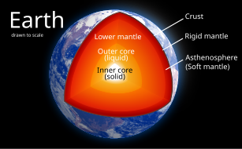

These layers are of differing density:
- Crust, least dense, 5-35km (5 km oceanic crust, 35 km continental)
- Upper mantle, rigid, 100 km - 150 km
- Asthenosphere, soft, 100 km - 700 km
- Lower mantle, solid but flowing, 2260 km
- Outer core, liquid, 2180 km
- Inner core, solid, 1220 km

Total: 11.73k to 12.3k km (actual 12.7k)

These layers react differently when it comes to the equatorial bulge. It's possible that:
- The softer the layer, the more it may bulge, and the faster it may adjust to the new bulge
- The denser the layer, the less it may bulge, and the slower it may adjust to the new bulge

Additionally, outer layers may bulge more due to being further away from the axis of rotation.

After the S1 -> S2 rotation, Earth may continue to maintain its oblate spheroid shape, along the same axis of rotation, due to its softer layers reacting immediately to the change in rotation.

## Crust Bulge Changes after S1 -> S2

How might the equatorial bulge react to the ECDO rotation?

Simply, I hypothesize that locations previously on the equator that move closer to the poles will move closer to the Earth's core, and those moving from the poles to the equator will move further away.

Estimating actual quantities here is important though, and the solution to this may lie in separating the Earth's internal layers into those which do and do not bulge, based on whether they are softer or more rigid.

Let's assume that the crust, asthenosphere, and outer core react immediately to accomodate the bulge. These layers are softer and make up up to 2910 km of the Earth's layers. Multiplying by 2 since the Earth is a sphere, these layers would make up approximately 5820 km of the Earth's 12.7k km diameter, which is ~46% of the diameter of the Earth.

These three layers have to accomodate the 43 km of equatorial bulge. The key here is figuring out how much of the equatorial bulge the crust accomodates:
- If we assume that they will share the load proportionate to their thickness, then the crust, which takes up up to 70 km of the 5820 km of soft layers, would take ~1.2% of the equatorial bulge load. This amounts to 0.517 km, 517 m, across 2 crust layers. For one crust layer it would be 259 m.
- However, if the crust accomodates more of the equatorial bulge than the inner layers due to being less dense and being further away from the axis of rotation, the potential crust displacement could be multiples higher.

## Comparing Earth's crust in S1 and S2 - Raw data

Here's where we put it all together.

First check out this map of the Earth in S1. Check the equator line, which runs through the top of South America and the bottom of South Africa.

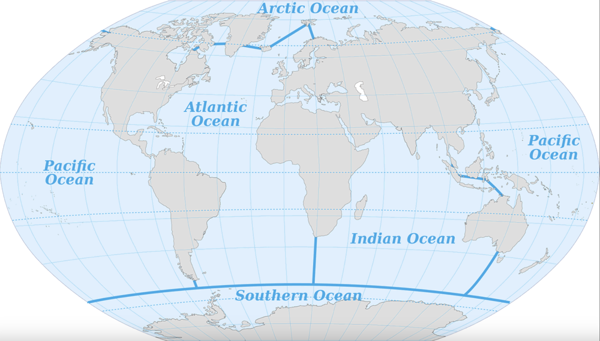

Now, take a look at this sequence of screenshots that shows the approximate line of the equator after S1 to S2, starting with the eastern pivot in Indonesia.

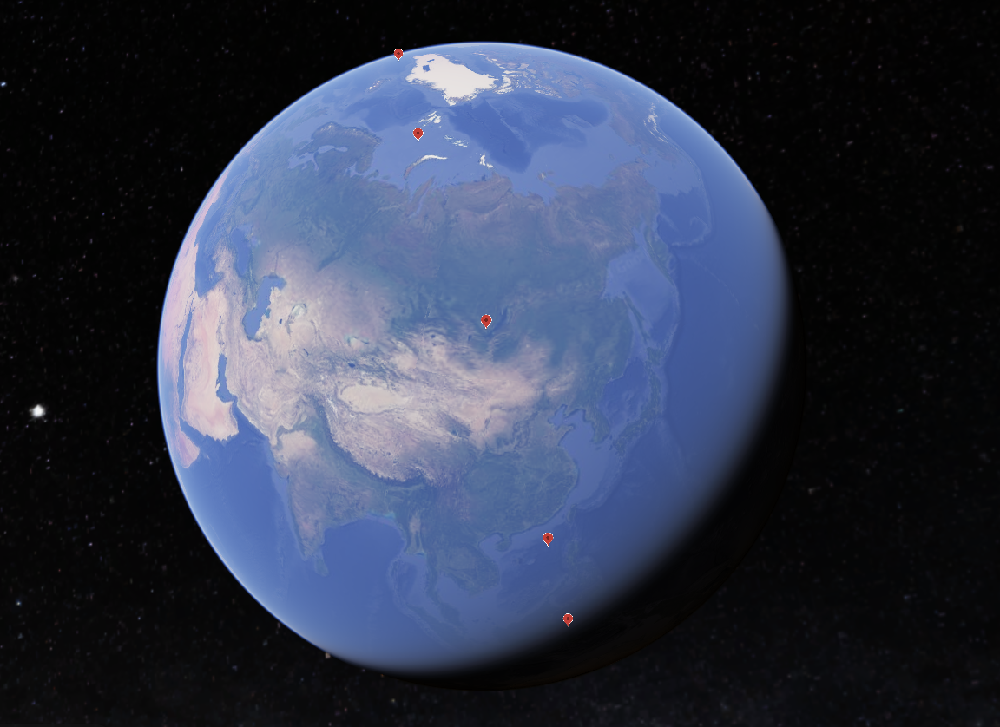
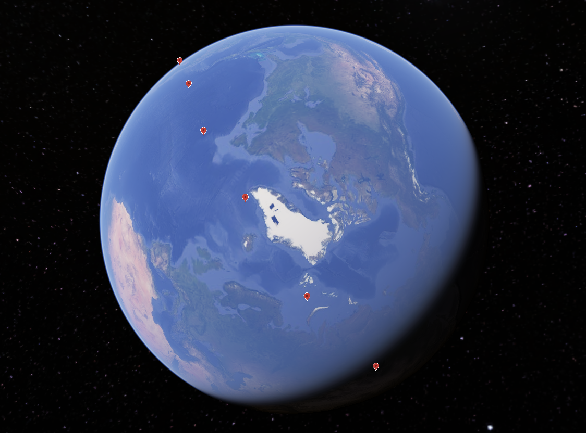
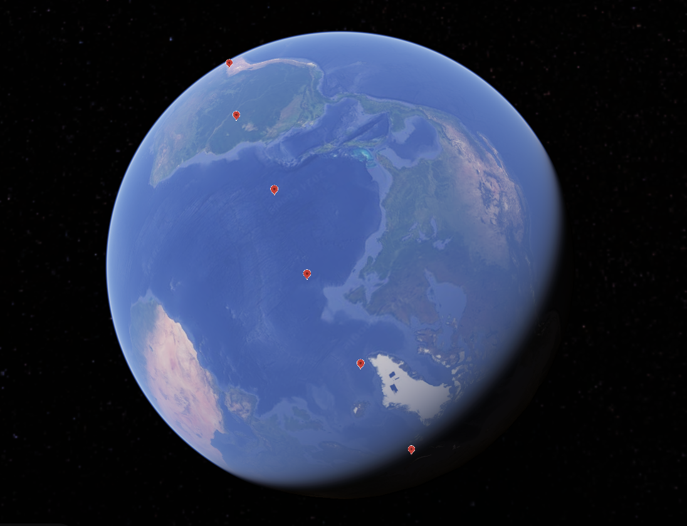
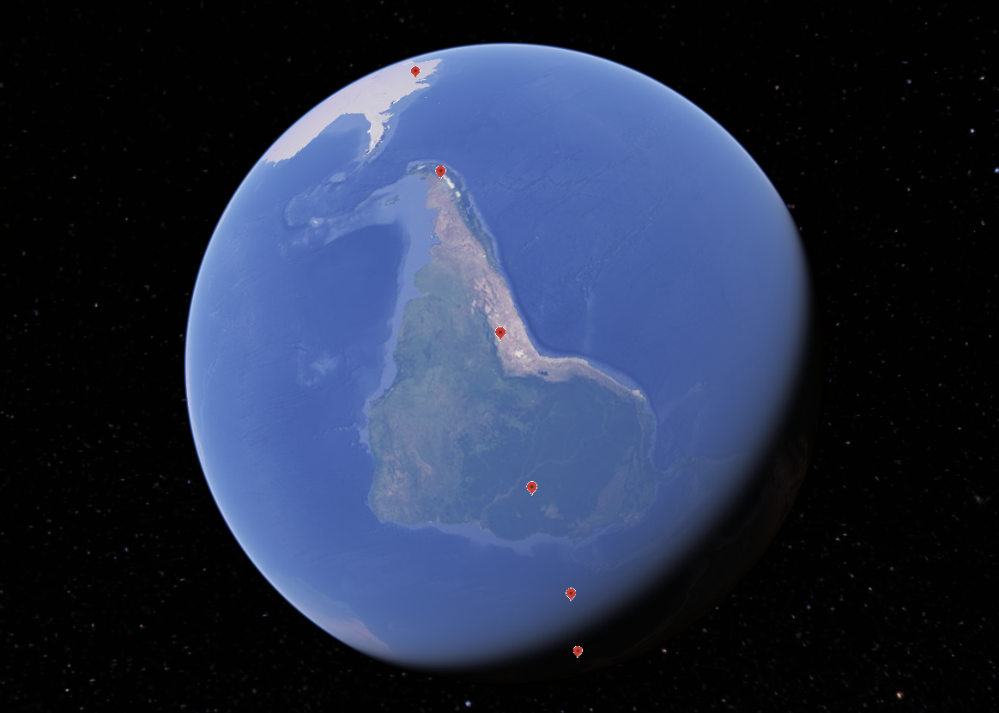
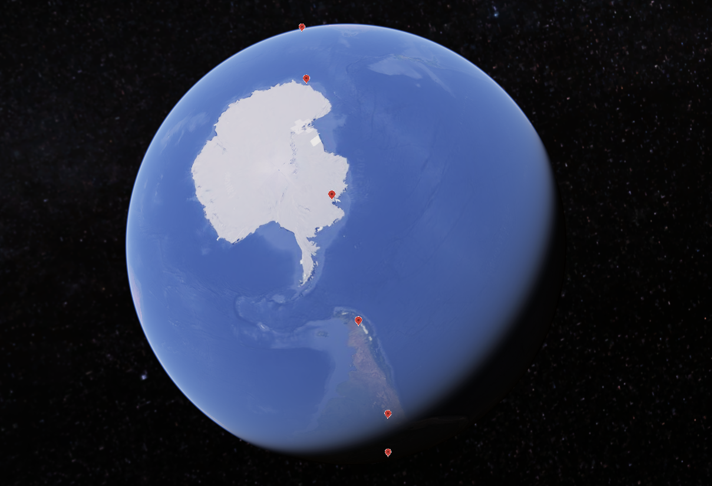

Note that there are now huge swaths of land on the equator - Eurasia, the Arctic, the full length of South America, Antarctica, Australia, and the shallow area around Indonesia. In fact, the only significant stretches of ocean are a slice of the Atlantic between North and South America and slices of the Pacific around Antarctica.

## Zones of increasing and decreasing latitude

Taking this analysis further, we can actually draw quadrants of the Earth's surface that will towards or away from the equator, based on lines on the surface which maintain the same distance.

These lines extend between the pivots, and are perpendicular to each other. From the eastern pivot, they run at bearings of:
- 38 degrees
- 128 degrees
- 218 degrees
- 318 degrees

In the following graphics:
- Green markers are pivots
- Red markers are points on the S2 equator that remain the same distance from the equator
- Purple markers are points on the S2 equator that move the most either towards or from the equator
- Yellow markers simply help visualize the line between the pivots and the red markers

The lines visualized by the yellow markers that connect the pivots to the red points don't change in latitude before and after the rotation. They can be thought of as boundaries for the Earth which may remain fairly constant in latitude. These lines divide the Earth into 4 "strips", touching both pivots, that alternate between moving closer and further away from the equator.

I've divided up each strip into two halves, resulting in 8 quadrants, which I display below.

Here are the two quadrants connected to the eastern pivot which move closer to the equator:

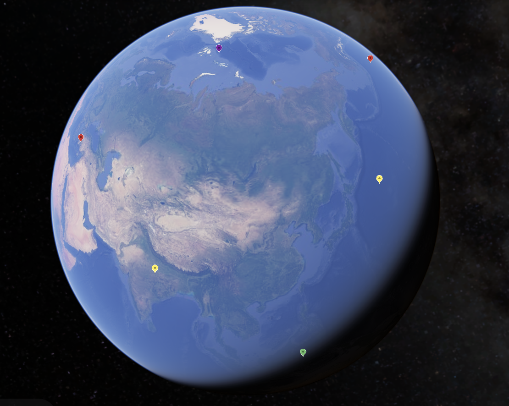
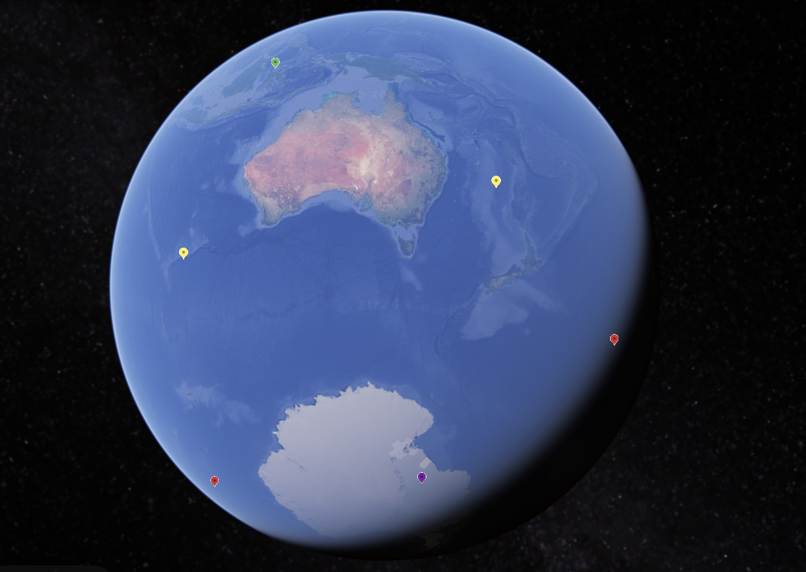

Here are the two quadrants connected to the eastern pivot which move away:

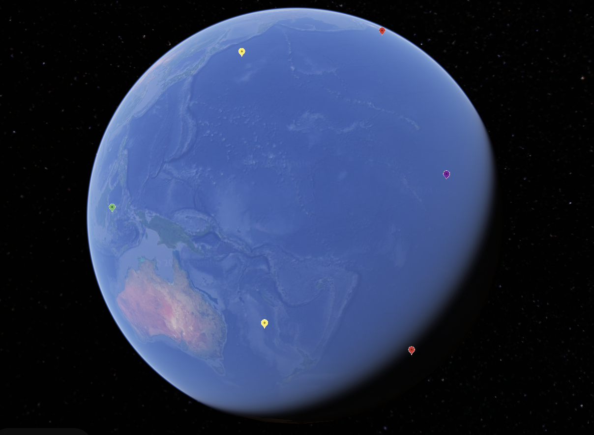

Here are the two quadrants connected to the western pivot which move closer:

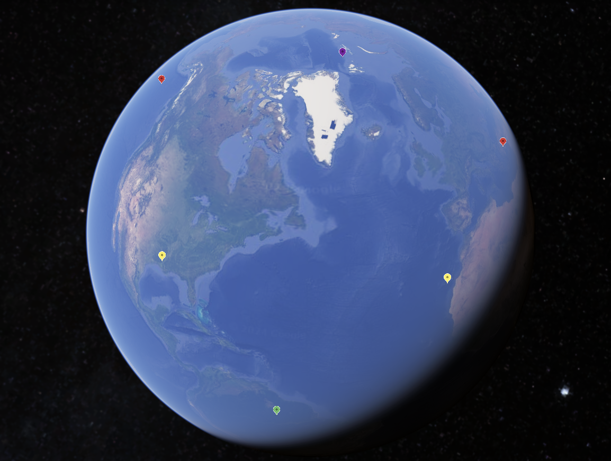
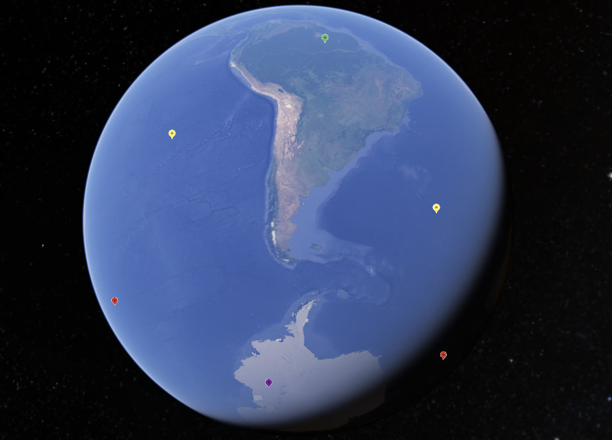

Here are the two quadrants connected to the western pivot which move further:

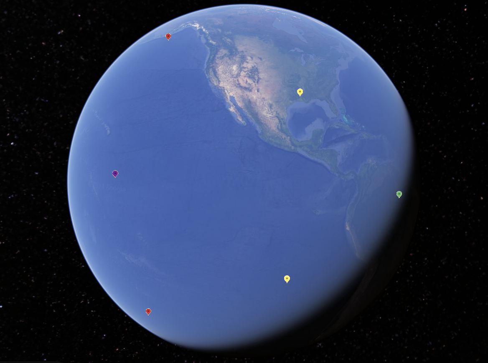
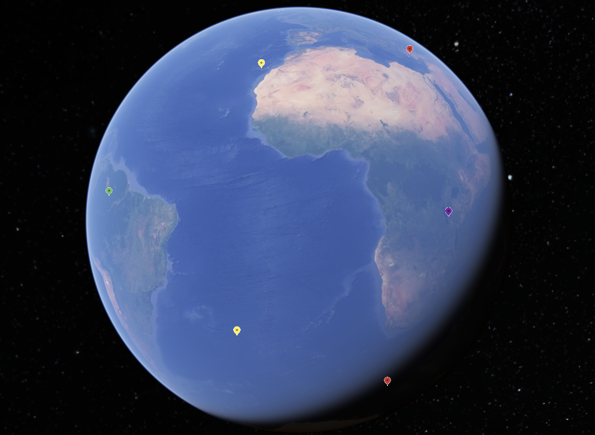

## My conclusion

As points on the Earth rotate closer or further away from the equator, they will rise or fall.

However, tectonic plates also need to be taken into account. I believe that changes in position on the spheroid will interact together with the tectonic plate structures to produce the final result; each location will need to be analyzed on a case-by-case basis based on the structure of the surrounding tectonic plates.

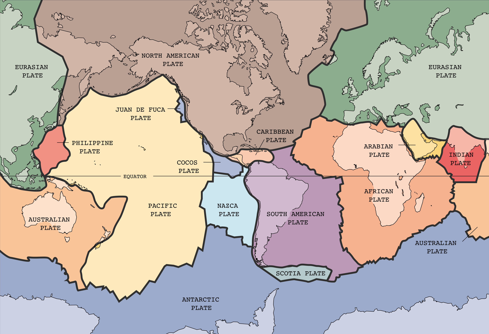

My analysis for the major plates follows:

The entire Eurasian plate is essentially contained within a slice that will move closer to the equator. In fact, the equator will run smack dab across the Eurasian plate. Therefore, I predict that the Eurasian plate will rise in elevation.

The North American plate currently does not lie on the equator. After the rotation, the equator will run through the east side of this plate. Therefore I predict the North American Plate, at least the eastern side, will rise in elevation.

The equator currently runs through the northern part of the South American plate. In S2, the equator will run the full length of the South American plate, on the west side. Therefore I predict that the South American plate will rise.

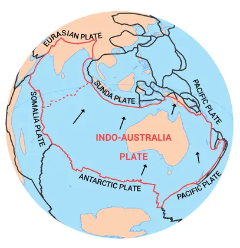

This is a very interesting region. The equator currently runs through the dotted red line in the Indo-Australian plate. In S2, the equator will run through Australia in the lower right piece of the Indo-Australian plate. I believe the lower piece of the Indo-Australian plate will rise, perhaps only slightly.

The Africa plate would fall as it is centered in a slice that moves away from the equator.

## Shallow oceans that may rise from under the ocean

Something really interesting is if you look at the Google Earth snippets where I show the equator line, you can see parts of the ocean that are denoted as shallower by a light blue color. I predict that many of these shallow coastlines will rise above the water and become part of the continent. A lot of the shallow areas are on areas that move to the equator:
- East Eurasia: The shallow coast going around the East of China and Russia
- Arctic region: The shallow coast above Europe, around the Arctic, and at the top of North America
- East coast of North America.
- South tip of South America (Drake Passage) which goes straight to the equator.
- Shallow coast around Antarctica.
- Shallow coast around Australia.

I also think the Sunda Plate has the potential to rise, because it is sandwiched between the Eurasian and Indo-Australian plates which would rise.

## S1 -> S2 inundation off the table?

It's important to note that the temporary inundation from the displacement of the oceans would still occur in the expected quick S1 -> S2 rotation - but then the oceans would recede to (or remain at) the new coastlines.

## Boundaries for latitude change direction

The following are the boundaries for latitude change on the 31 meridian and 149 meridian west, which are the points of greatest rotation, after the S1 -> S2 rotation:
- 31 meridian 52 S to 38 N: Greater latitude
- 31 meridian 38 N to 149 meridian west 52 N: Lower latitude
- 149 meridian west 52 N to 38 S: Greater latitude
- 149 meridian west 38 S to 31 meridian 52 S: Lower latitude

The points of greatest latitude change are halfway between these boundaries:
- 31 meridian 7 S
- 31 meridian 83 N
- 149 meridian 7 N
- 149 meridian 83 S

## Explaining Khafre Pyramid Inundation

Earth's equatorial bulge could explain the Khafre pyramid's extended inundation to achieve the erosion on its surface.

The Khafre Pyramid is on the Africa plate, which is predicted to fall as it moves to the north pole. However, it is on the northern part of the Africa plate which is very close (right under) to the line of no latitude change. The Khafre Pyramid only gains 14 degrees of latitude after the rotation.

So, a minor inundation of 175m above current sea level would be quite reasonable.

## Violent Tectonic Plates Prediction

Likely, the tectonic plates that move significantly relative to the equatorial bulge will have very violent reactions with surrounding plates during the ECDO rotation.

## TODO things to look into

This is still an incomplete and simplistic model. Rather than eyeballing it, you could graph the equatorial bulge as a spectrum for each point and then compare areas before/after the rotation together with plate boundaries. This could give you a much better picture of what might happen.

More precision to test the model:
- Khafre 175m
- Kumari Kandam
- Get more data points.

It's not immediately clear how water will interact with the equatorial bulge. For example do plates that move away from the equator sink to have a deeper sea, taking in water, or do they shave their equatorial ocean bulge off, letting off water?

How fast could the equatorial bulge shift to maintain its shape around the rotational axis if Earth were to suddenly rotate? What if its immediate, responding in its softest layers, with perhaps a slight bounce back as the other more solid layers take time to adjust?

## Citations

- Earth layers: https://en.wikipedia.org/wiki/Internal_structure_of_Earth
- Earth layers: https://www.sciencefacts.net/layers-of-the-earth.html
- Earth crust thickness: https://www.geolsoc.org.uk/Geoscientist/Archive/August-2018/Roberts-Crust
- Tectonic plate maps: https://earthhow.com/category/geology/plate-tectonics/africa
