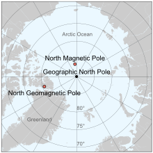
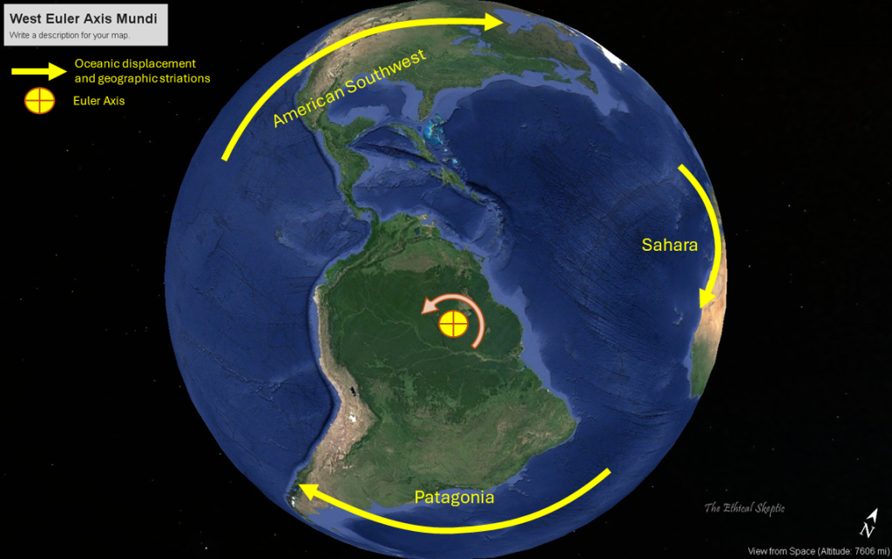

# Rotation Vector Field

The purpose of this document is to understand exactly what direction and strength the rotation will be, on the surface of the Earth, during S1 -> S2.

Of course, the answer is not a constant, but depends on which point on the Earth's surface is in question.

## Prerequisite Knowledge - axial tilt and north poles

To start off we will cover some basic knowledge regarding the Earth's rotation.

### Axial Tilt

Axial tilt is the angle between an object's rotational axis (spinning) and its orbital axis (orbit), which is the line perpendicular to its orbital plane, which is the plane along which, for Earth, it rotates around the Sun. The Earth's axial tilt is about 23.4 degrees. depicted by the red line in the below gif which does not point straight upwards. However, we don't need to concern ourselves with this number just yet. The rest of the explanation will all be done whilst factoring out the (tilted) rotational axis.

### North Poles

Next I'll cover the North Poles. There are 3:
- The geographic north pole is the northern Earth surface point intersecting with Earth's axis of rotation. It's where lines of longitude meet at the top of the Earth.
- The north magnetic pole is the point on the north surface of the Earth where the planet's magnetic field points directly downward. Presumably, this is found through measurement
- Finally, the geomagnetic north pole, which would be the north pole in an approximate dipole model of the Earth's magnetic field

Currently, none of the 3 are the exact same point.

The one I will reference in this page is the geographic north pole.

## How does the Earth rotate during S1 -> S2?

So, during S1, the Earth is rotating along its rotational axis:

The rotation during S1 -> S2 can be thought of as occuring independently of this rotation. During S1 -> S2, a new Earth surface point in South Africa is brought to the geographic North pole, which looks like this, cross-sectionally:

As the South Africa LLVP rotates to the geographic north pole as the Earth continues to spin around its rotational axis, the South Africa LLVP will follow an arcing path like this:

## Western and eastern pivot points

These are the two points on the Earth's surface which don't have their rotation affected during S1 -> S2 (they continue to rotate along the normal 24-hour Earth rotational path). They are both on the equator, and lie on a single line that also goes through the center of the Earth.

The coordinates of these points in lat/long degree format are:
- Western pivot, Venezuela: (0.0, -59.0)
- Eastern pivot, Indonesia: (0.0, 121.0)

During S1 -> S2, Earth rotates counterclockwise around the western pivot (looking down onto Earth) and clockwise around the eastern pivot. The arrow around the western pivot here shows how the Earth will rotate, while the long yellow arrows at the extremities show the direction of water movement.

Here's the eastern pivot:

By drawing radial circles around the pivots, we can find the direction of rotation at any point.

## Calculating rotational speed

We not only need to know the direction of rotation but also the speed of rotation. This depends on how far away said point is from the pivots. The closer the point is to either of the pivots, the less rotational speed it will endure, and the farther away from the pivots, the greater.

We can use basic trigonometry and some simplifing assumptions to calculate rotational speed.

If:
- theta is the angle between a point and the closest pivot
- r_earth is the radius of the Earth (~6371 km)
- t is the number of hours it takes to go from S1 -> S2

Then:
- Radius of rotation of the point (r) = `r_earth * sin(theta)`
- Average rotational speed = `rotational circumference * (104/360) / t` = `2 * pi * r * (104/360) / t`

## Rotational speed example - Singapore

I'll calculate the rotational speed of Singapore as an example.

Asking ChatGPT, the angle between Singapore and the eastern pivot is about 17.3 degrees.

Then, the radius of rotation of Singapore is:
- `r_earth * sin(17.3)`
- = `6371 km * 0.297`
- = `1895 km`

Then, the average rotational speed, assuming S1 -> S2 takes 6 hours is:
- `2 * pi * r * (104/360) / t`
- = `2 * pi * 1895 km * (104/360) / 6 hr`
- = `573 km/h`

So during S1 -> S2, Singapore will be rotating clockwise around the eastern pivot in Indonesia at an average speed of 573 km/h.

## Drawing rotational vector field example - Singapore, Tokyo, Dubai

Finally we can map the direction and speed of rotation across many points in the map to get a rotational vector field. Here is a very simple example I did for Singapore, Tokyo, and Dubai, rotating around the eastern pivot in Indonesia.

Here is the predicted average rotational speed at each city assuming a 6 hour rotation:
- Singapore: 17.3 degrees from pivot, ~573 km/h
- Tokyo: 26.7 degrees from pivot, ~866 km/h
- Dubai: 43.2 degrees from pivot, ~1319 km/h

## Water displacement

It can be expected that the water displacement will run in the reverse direction of land rotation, with a proportional strength to the speed of rotation at that point.

## Citations

- https://en.wikipedia.org/wiki/Axial_tilt
- https://en.wikipedia.org/wiki/North_magnetic_pole
- https://theethicalskeptic.com/2024/05/12/exothermic-core-mantle-decoupling-dzhanibekov-oscillation-ecdo-theory/