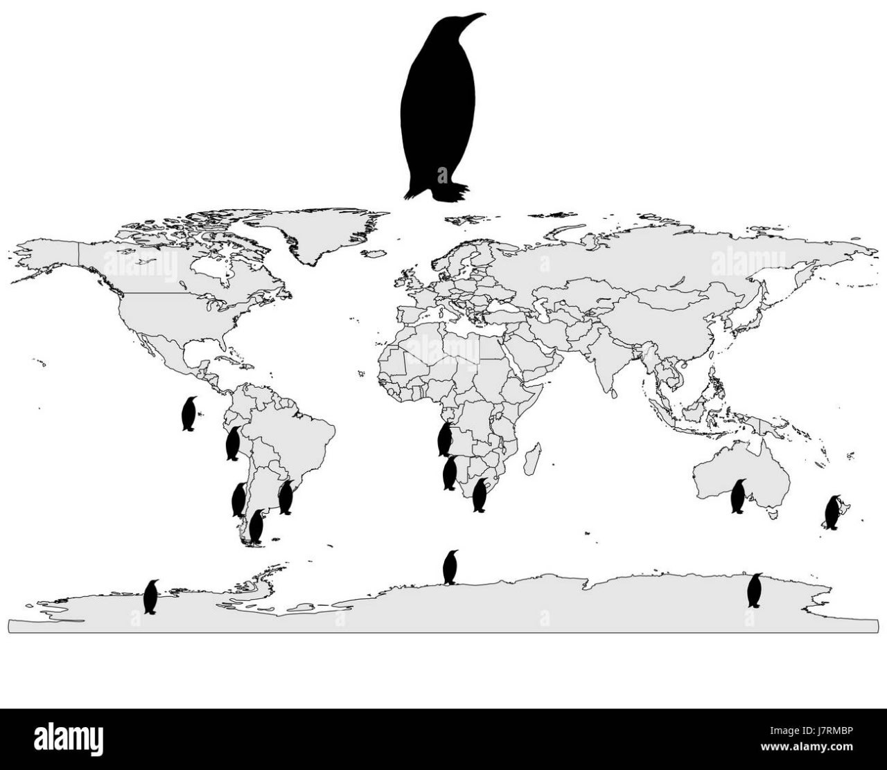

# Physical Evidence of ECDO events

This folder is for physical evidence of past ECDO events, such as frozen animal remains.

## Clay

Varved clay proxies provide sub-annular paleomagnetic resolutions. The following charts are taken from Annual and inter‐annual magnetic variations in varved clay, Nils‐Axel Mörner (1978)[1], wherein paleomagnetic findings from VC cores dated to ±13,150 BP (spanning 156 varves/years) and ±10,000 BP (spanning 300 varves/years) are shown. These two cores span the Gothenburg Flip & Excursion[2] and the Ornö Declination Departure.

What appears to be recorded in these proxies are  multiple geomagnetic excursions and reversals which occurred within short succession, most within a few years to a couple of decades apart, with the majority reflecting a declination change of 80°-120°. This looks very much like what I would expect to see recorded from a series of ECDO-type events[3].

Coloured elements are my own additions. Blue and red indicate selected reversal points of magnetic declination. Orange numbers are the approximate number of varves/years between the reversals. Green curves and text indicate the approximate number of degrees change between the selected reversals. Raw chart values which exceed 180° have been subtracted from 360° and the absolute delta value displayed bracketed.

[1] http://dx.doi.org/10.1080/09291017809359640
[2] https://sciencedirect.com/science/article/abs/pii/003358947790031X
[3] https://theethicalskeptic.com/2024/05/23/master-exothermic-core-mantle-decoupling-dzhanibekov-oscillation-theory/

## Penguins

"What do the existence of penguins in Antarctica tell us about the flip? There is no good reason for these birds to have evolved the life cycles they have on this unforgiving continent. They are compete outliers of mainstream science unless they are able to survive the flips and survive and prosper in Antarctica in stages 1 and 2.""

They seem to be concentrated on non-polar coasts which are closest to Antarctica.