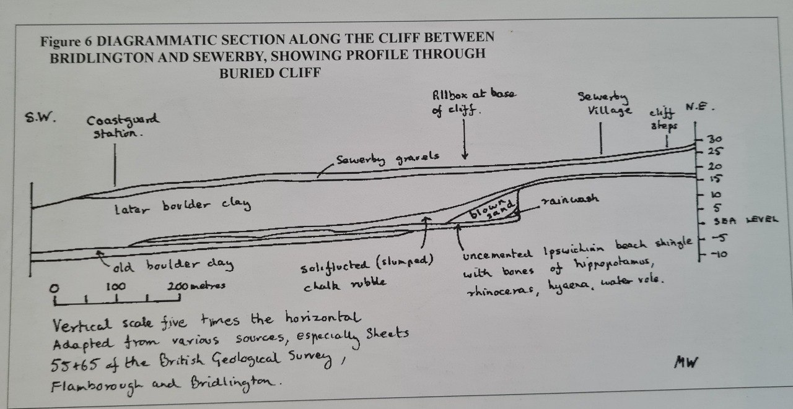
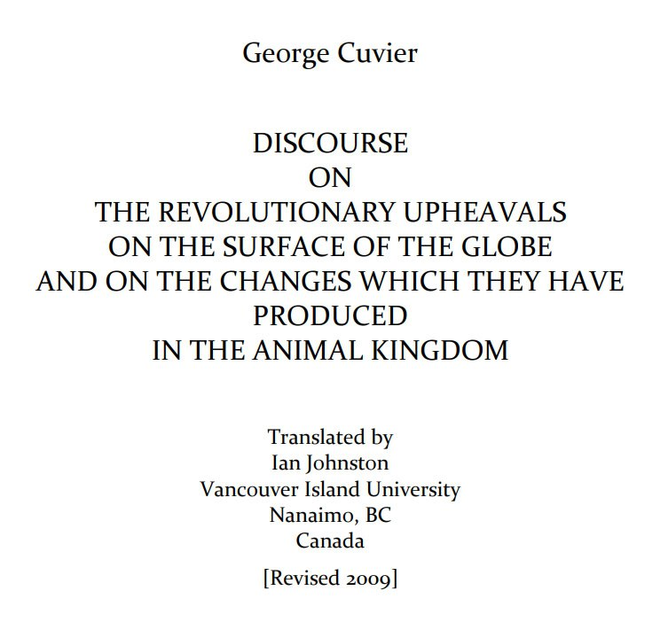
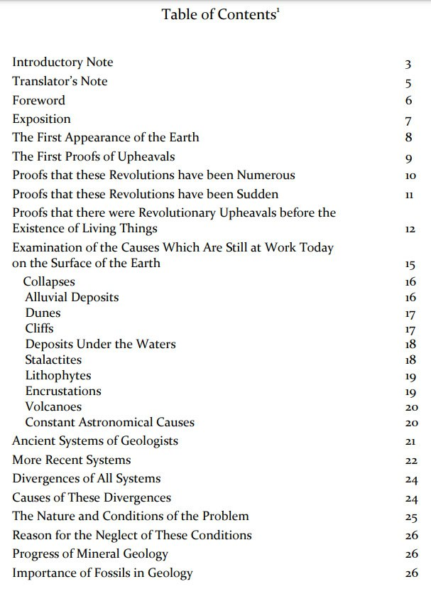

# Animal Remains

This folder is to document old animal remains that can give us clues about how they might have died.

Check `img/` for many records.

## Fairbanks Mammoth 1948

Mining team uncovered the frozen remains of a young mammoth in Fairbanks. Lush vegetation in its mouth showed that the animal died during the growing season in an apparently warm climate.

Secondly the animal had been frozen immediately after death, since its flesh was said to be edible.

So a mammoth foraging in the summertime was almost instantaneously frozen and remained so for 20 millenia.

## Alaska Frozen Mosquito

Dig at the remains of a sunken prehistoric tropical lake community between Nome and Kotzebue, Alaska. While digging, an archaelogist unearthed a mosquito that flew away after thawing. In order for a mosquito to be revived after being frozen, its freezing would have to be followed by a sharp and permanent drop in temperature. Normal freezing would have caused ice crystals to grow within the creature, rupturing the membranes. So it was freezing in a sudden deep freezing.

## East Yorkshire Bio-floodmass

However I don't think the boulder clay was deposited by melting glaciers though and think a deluge buried the old coastline. I'll send some pictures from a book a local Geography teacher wrote which you might find interesting

Note on this one that at the base of the buried cliff are bones of hippopotamus, rhinoceros and hyena. These were either deposited by ice sheets our buried there after a production of the lion king. Or smashed by a deluge in the not too distant past.

## Frozen Mammoth

Viable DNA from the last cataclysm?

https://www.livescience.com/animals/extinct-species/siberian-gold-miners-accidentally-find-ancient-woolly-rhino-mummy-with-horn-and-soft-tissues-still-intact

That was Chan proposed mechanism - flash frozen due to supersonic wind speeds and water due to the rotation.

## Book about deluge

Reliquoæ Diluvianæ (1823)
A 380 page record of an historic deluge, overflowing with findings of numerous species of fauna which had no explicable reason to be found together, scattered across Britain and Europe, buried in layers of 'diluvium' (a term coined by Buckland).
https:// (https://t.co/K4GQDGqcHv)iiif.wellcomecollection.org/pdf/b2201729x (https://t.co/K4GQDGqcHv)

## Whales

Dead whale bones in Egypt.

Whale skeletion in Osa Peninsula, Costa Rica.

## Cuvier Books

In `books/` you can find several books written by Cuvier about animal and vegetable remains that he predicted came from sudden disasters.

"By closely examining what has happened to the surface of the earth since it has become dry land for the last time and the continents have taken on their present shape, at least in their somewhat elevated areas, we see clearly that this last revolution and consequently the establishment of our present societies could not be very old. It is one of the most firmly established results and, at the same time, the least attended to in legitimate geology, a result even more valuable because it links up natural and civil history in an uninterrupted chain." - Georges Cuvier, Discourse (1819)
[1] https://web.viu.ca/johnstoi/cuvier/cuvierweb.pdf

"If we examine with even greater care the remains of these organic creatures, we come to discover in the middle of the marine strata, even the most ancient ones, layers full of animal or vegetable products from land and fresh water. In the most recent layers (i.e., the ones closest to the surface) there are some where land animals are buried under masses of marine creatures. Thus, not only did the different catastrophes which moved the layers gradually make the various parts of our continent rise up from the bosom of the waves and reduce the size of the sea basin, but this basin has been shifted in several directions.

But it is also really important to note that these irruptions and these repeated retreats were not all slow and did not all take place gradually. On the contrary, most of the disasters which brought them on have been sudden. That is especially easy to demonstrate for the last of these catastrophes, which by a double movement inundated and later left dry our present continents or, at least, a great part of the land which forms them today."

https://web.viu.ca/johnstoi/cuvier/cuvierweb.pdf