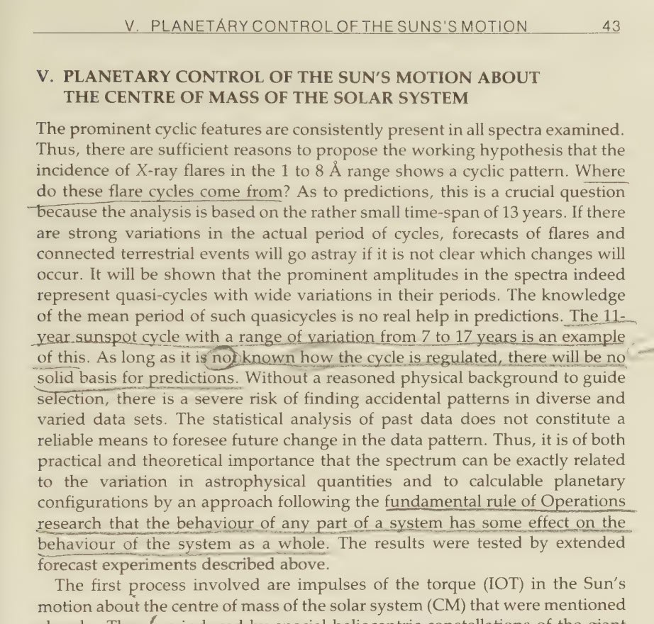
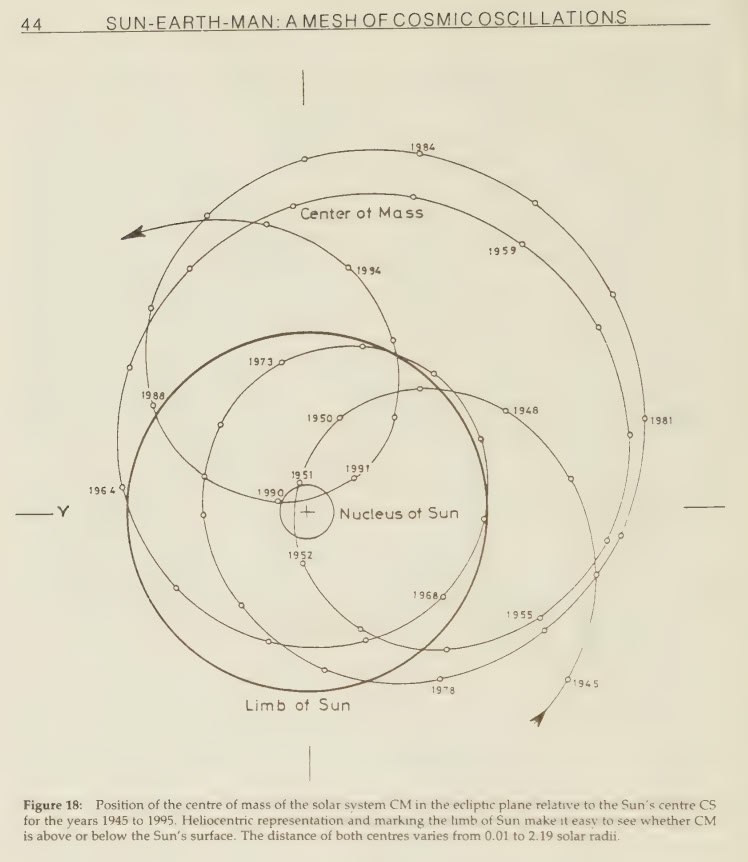
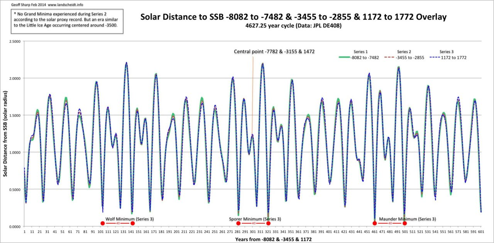

# Solar System

This folder is for evidence from the surrounding solar system that points to potential ECDO events.

## Sun-Earth-Man, Theodor Landscheidt

A prediction from 1988, based in planetary and solar harmonics: "The extrema in the secular wave of IOT [Impulses of Torque on the sun from the gas giants] can be taken to constitute a smoothed supersecular wave with a quasi-period of 391 years. This long wave points to indications that secular and supersecular sunspot minima are related to variations in climate. Thus a prolonged period of colder climate is about to be initiated by the secular minimum past 1990, will reach its deepest point around the supersecular minimum in 2030, and come to an end about 2070." - Sun-Earth-Man, Theodor Landscheidt (1988)

In the heliophysics community Landscheidt's name is well known - there was (and still is) a great deal of support to name this minimum the Landscheidt Minimum. His work complements that of Alexander Chizhevsky, Nicola Scarfetta, Geoff Sharp and Carl Smith. Collectively they have pretty much conclusively identified the relationship between climate cycles (and many other things) and the movements of the gas giants. Their work remains pretty well hidden to this day as it would destroy AGW in an open debate.

And heliobiology, which was Chizhevsky's preferred area - the physical and behavioral effects of solar and cosmic cycles on living things.

[1] https://archive.org/details/sunearthmanmesho0000land

These planetary lulls occurring 40 years apart every 4627 years may be the two moments that the decoupling occurs.